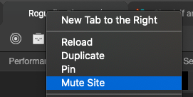

# Roguelite Phaser

## How To Use
```bash
# Install dependencies
$ yarn

# Start the local development server (on port 8080)
$ yarn start

# Build the production ready code to the /dist folder
$ yarn build
```


## Building to native platforms

### Desktop 💻
```bash
# If you don't have electron installed yet
$ yarn platforms

# Skip right into this if you already have electron in the project
$ yarn desktop
```

## Music is too annoying?
Right click on the tab -> Mute site

